# AI応用予測モデル
深層学習を用いた学習器によって非線形を含む多変量回帰、時系列解析による予測モデルを生成出来ます。

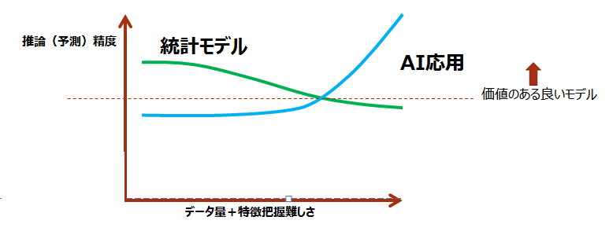  

- メリット   
  統計解析の知識が無くてもとりあえず予測モデル作る事が出来る。（デフォルトのハイパーパラメータのままでは統計モデルに負けます）データ量とハイパーパラメータ調整次第で高い精度のモデルが作れます。  

- デメリット  
  計算が非常に遅い、良いモデルが出来なかった場合にハイパーパラメータ調整がとても難しい。
  モデルが出来てもそのモデルから有用な理解が出来ない（ブラックボックス化）という問題もあります。

  
---

# 回帰モデル
回帰モデルは「ある条件値」（説明変数）を与えたとき「ターゲットの値」（目的変数）を予測するモデルです。予測に使うデータはモデル作成の時のデータ列と同じである必要があります。ただし、ターゲット（目的変数）はモデルによって予測されるので適当な値を入れておきます。
テストとしてモデルの精度を検証する場合は実測値を入れておくと精度の良し悪しが判断できます。

# 回帰モデルの基本的なパラメータ  

## learning_rate 
- デフォルト値は1 です。
1に設定すると、自動的にラーニングrateを設定します。
1以外では指定された値がラーニングrateとして採用されます。　　

  

# 信頼区間
ハイパーパラメータの「信頼区間の推定」にチェックを入れることで信頼区間推定を行います。
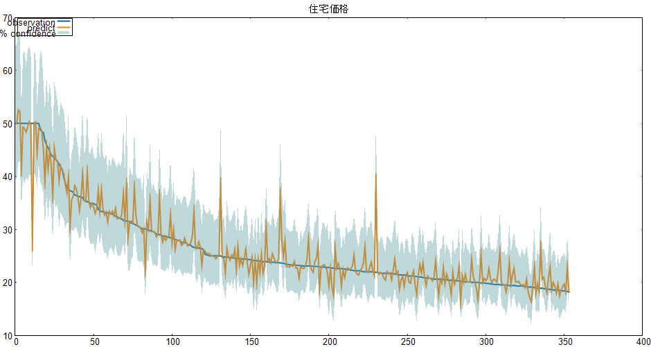  
表示させるには
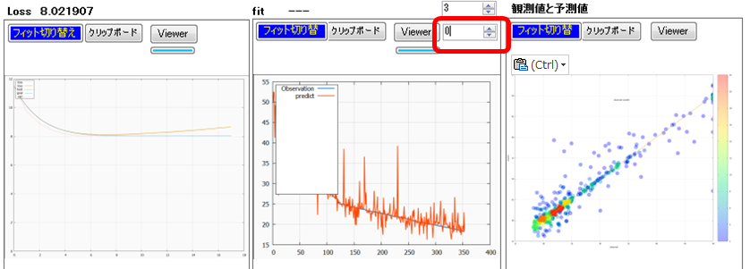 

  
---

# 時系列モデル
時系列モデルは過去のデータをを与えたとき時間的に後の将来「ターゲットの値」（目的変数）を予測するモデルです。回帰モデルと大きく異なるはデータの行方向の並びを変えることが出来ない事とです。また最初の何ステップ分かは入力シーケンスとして扱われるため学習データには含まれません。

# 訓練
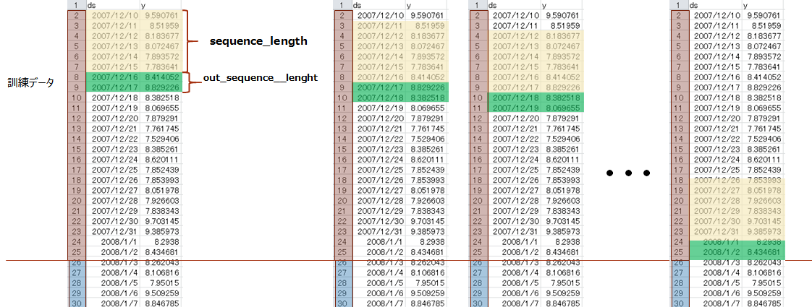  

# テスト
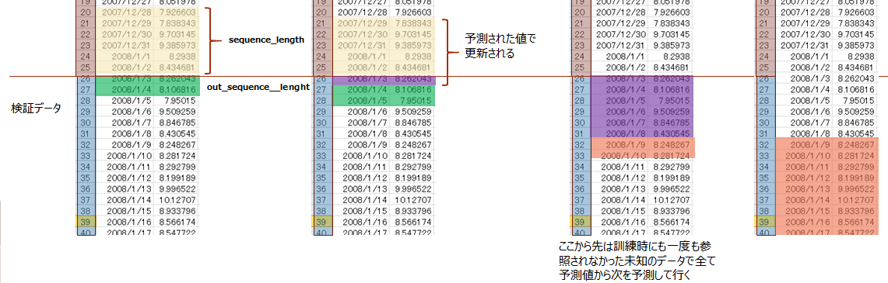  
予測に使うデータはモデル作成で使ったデータの（過去）時系列データと連続している仮データが必要で将来予測におけるターゲット（目的変数）はモデルによって予測されるので適当な値を入れておきます。
テストとしてモデルの精度を検証する場合は実測値を入れておくと精度の良し悪しが判断できます。

---

# 時系列モデルの基本的なパラメータ  

  ## learning_rate 
- デフォルト値は1 です。
1に設定すると、自動的にラーニングrateを設定します。
1以外では指定された値がラーニングrateとして採用されます。　　

　　
## sequence_length と out_sequence__lenght

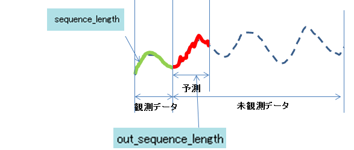

## target_positon
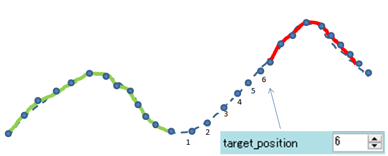  

---
# 予測方法の選択  
常に最新の観測データが手に入る場合としばらく観測データが手に入らない場合がります。精度の高い予測する場合、最新の観測データをなるべく使った方が良いため観測地を使うか使わないを選択出来ます。

## 可能な限り観測値を使う場合と使わない場合

- 観測データの入手までに時間が掛からない場合や短期間予測で十分な場合。わりと精度が悪化しない。  
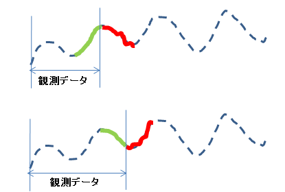  

- 観測データの入手までに時間が掛かる場合や長期間予測が必要な場合。予測精度が悪くなる傾向にある。  
- 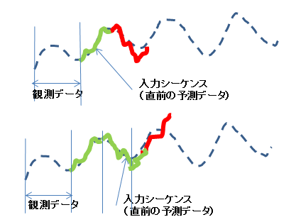  

  

# データの時間方向のシフト処理

- 未来の説明変数を使う（プラス値）
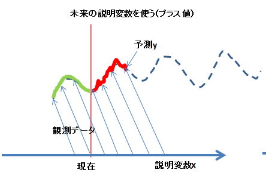 

- 過去の説明変数を使う（マイナス値）
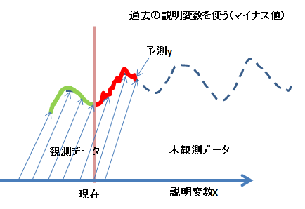   

  

# データに無い未来予測（予言）
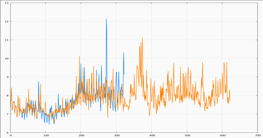  

  

## prophecy
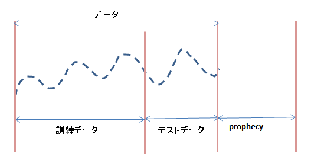  

# 信頼区間
ハイパーパラメータの「信頼区間の推定」にチェックを入れることで信頼区間推定を行います。
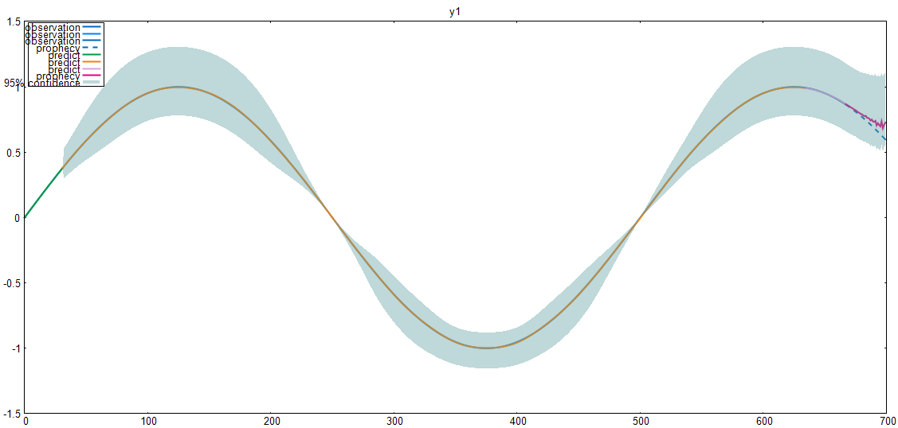  
表示させるには
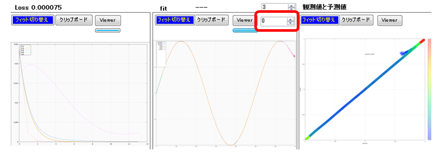 