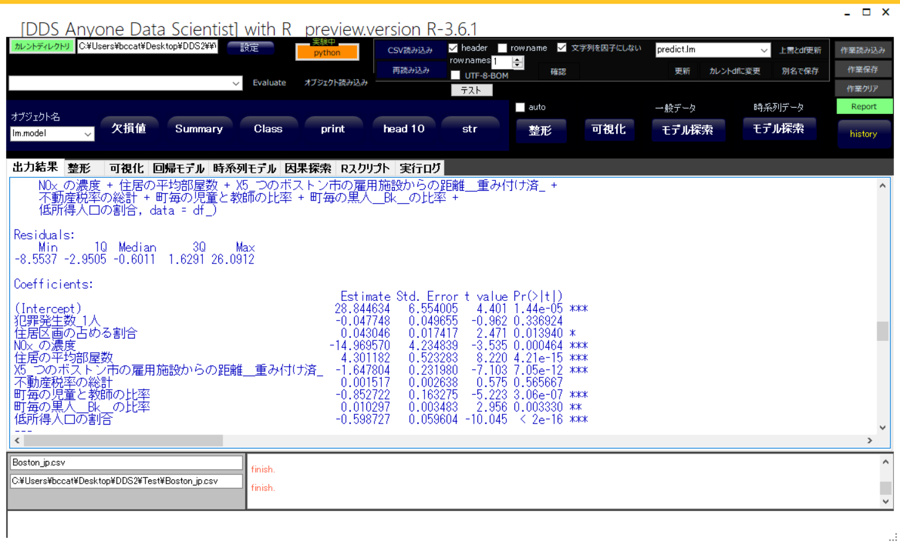

# Data_analysis_tools
 
**R**プログラムを作成せずに**R**を最大限に活用するアプリケーション  

**R**は世界で最も信頼できるデータ解析ツールの一つですがR言語でプログラムを作成する必要があります。Rをバックエンドで使うGUIアプリケーションとしてノンプログラミングでそのR及びそのパッケージを使いたいと思います。  
- - -
## Future  
- 高度な予測モデルは、GUIでのみ作成できます。  
- ある程度は役に立ちます。  

## Features  
-統計の専門知識は必要ありません。  
-プログラム（スクリプト）にコーディングは必要ありません  
-予測モデルはGUIでのみ作成できます  

## requirements  
**Visual Studio 2017** or higher is required to build.  
- [ScintillaNET v3.6.3](https://github.com/jacobslusser/ScintillaNET)
- [Magick.NET-Q16-AnyCPU v7.18.0](https://github.com/dlemstra/Magick.NET)
- [MetroFramework v1.2.0.3](http://thielj.github.io/MetroFramework/)
- [Markdig v0.17.1](https://github.com/lunet-io/markdig)
- [WindowsAPICodePack-Core v1.1.2](https://github.com/aybe/Windows-API-Code-Pack-1.1)
- [Ookii.Dialogs.WinForms v1.1.0](https://github.com/augustoproiete/ookii-dialogs-winforms)

ビルドされたアプリケーションを実行するために必要なライブラリ  
- [R-4.2.3](https://www.r-project.org/)
- [gnuplot](http://www.gnuplot.info/)
- [Graphviz](http://www.graphviz.org/)
- [Rtools](https://cran.r-project.org/bin/windows/Rtools/history.html)  
※Rtools must match R version  

### Application  
**app_setup.bat**を実行して、**Application\DDS2**に収集されます
**Application\DDS2\DDS2.bat**によって実行されます。
- - -

**申し訳ありません。
このアプリケーションは現在、日本語のGUIです。**
